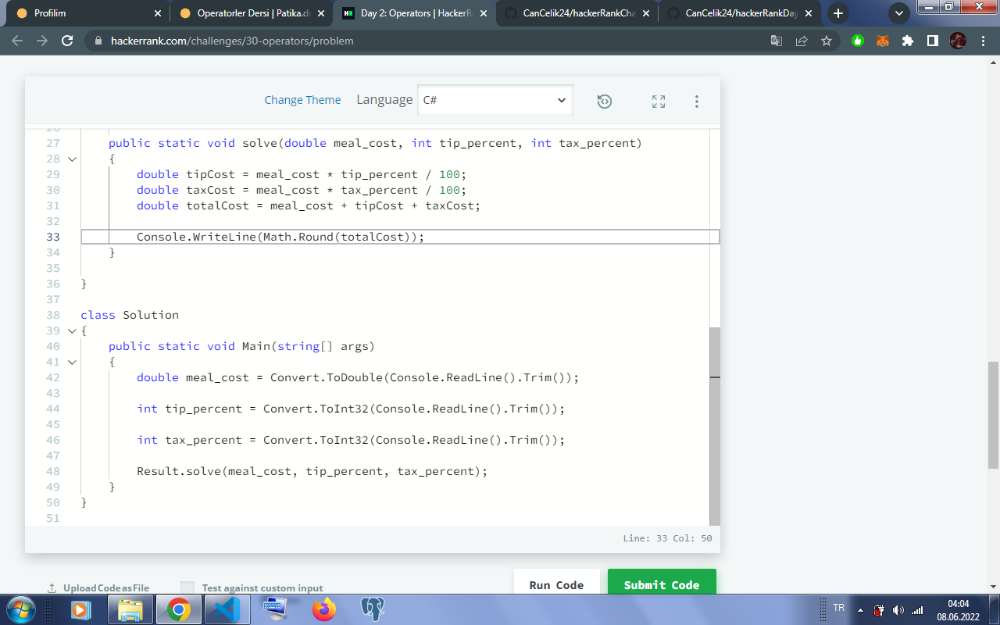

# hackerRankDay2Operators
[Kodluyoruz](https://app.patika.dev/) .Net eğitimi için hazırlanan C# Operatörler ödevidir. Hacker Rank Challenge Day 2: Operators cevabı için oluşturulmuştur.
## Hacker Rank Day 2: Operators
- Öncelikle bahşiş oranı ve vergi oranı tanımlanıp yüzdeleri alınmıştır.
  ```
  double tipCost = meal_cost * tip_percent / 100;
  double taxCost = meal_cost * tax_percent / 100;
- Yukarıda hesaplanan tutar toplanıp yemek tutarı tanımlanmış ve eklenmiştir.

      double totalCost = meal_cost + tipCost + taxCost; 

- Son olarak 'totalCost' değişkenini integer türüne dönüştürmek için 'Math.Round' metodu kullanılmış ve sonuç yazdırılmıştır.

      Console.WriteLine(Math.Round(totalCost)); 
- Görsel;

  

### [Hacker Rank Profilim](https://www.hackerrank.com/ogulcan_celik24) 
#### https://www.hackerrank.com/ogulcan_celik24
#### www.patika.dev

